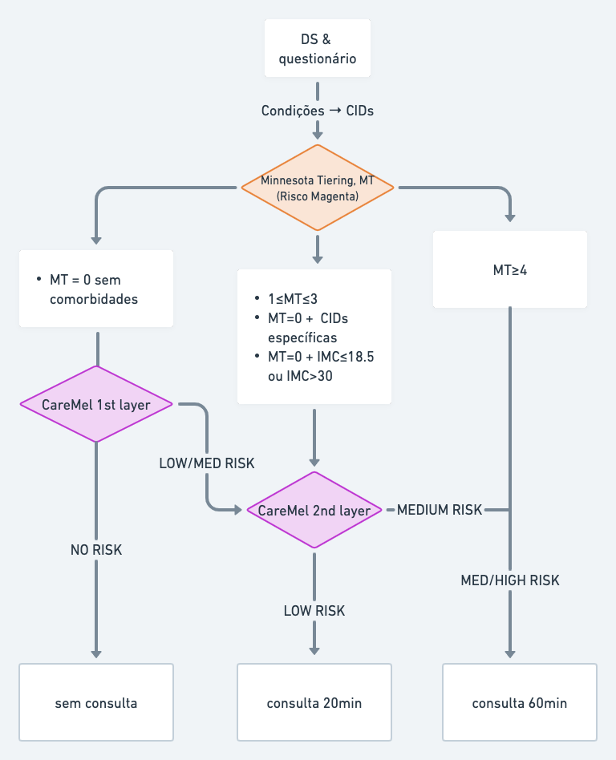

# CareMel, a care model

    
        Built by 
        <a href = "https://github.com/luizhsuperti">LuizSuperti</a>
        and the <a href = "https://github.com/alice-health"> Alice Community </a>
    

# Table of contents
- [1. Introduction](#Introduction)
- [2. First Layer - Model Description](#model)
- [3. Specifics](#specifics)

## 1. Introduction 
[(Back to top)](#table-of-contents)
The CareMel is a Machine Learning model that assists Alice's health team in allocating our members in care tiers during the onboard. When entering, our users - called members - fill health questionnaires. Based on that questionnaires, a 60 minutes medical appointment, and medical expertise, our doctors allocate the members in our four tiers of care. the four tiers are based on the member's health condition: 

 - `NO-RISK`
 - `LOW-RISK`
 - `MEDIUM-RISK`
 - `HIGH-RISK`

This model comes to reduce the workload of our medical staff by assessing if members with no health conditions (i.e. no `ICD` codes), or with diseases that do not represent health risks, such as myopia or rhinitis, need to pass through an initial medical appointment. Members can have underlying medical conditions that are not detected in the questionnaire but that a medical appointment can help in detecting them. Although rare, an initial healthy member can be allocated to a higher level of medical attention if a doctor feels that it is necessary. 

The model is applied on a health risk calculator that is based on the `Minnesota Health Risk Tiering` (`MT` for short), which is our first line of assessing an user medical condition. If MT says that if a member is medium risk or above, the model is not activated and he\she needs to pass a medical examination. If MT perceives the member as no risk, then the **first layer** of the model is activated; The *first-layer* simply classifies the member into `NO` or `LOW` risk. No-risk members continue their onboard as planned for no-risk members. low-risk members classified by CareMel are then added to low-risk members classfied by MT, and then they pass through
CareMel's **second layer**, which splits the members into `LOW` or `MEDIUM` risks. Low-risks members passes through a short medical appointment of 20 minutes, while medium risks pass the standard medical appointment and examination.
### 1.1. CareMel flowchart

### 1.2. CareMel members allocation

For each layer, the member must meet some conditions to pass through the model, as showed in the flowchart. The following table shows the specifics for the conditions, so the   *slice* of the cohort that will pass through the layers is correct.

|   **CareMel Layer**  |   **Condition**   |   
| ----------------- | -------------------------------------- |
| 1st Layer | Minnesota Score (MT) = 0 + no conditions specified on the 2nd Layer. |      
| 2nd Layer | <ul><li> $1 \leq \text{MT} \leq 3$ </li><li> MT = 0 + $\text{ICDs} = \{D50, D51, E05, E06, E07, G40, I42, I49, I57, J41, J42, J43, K25, K26, K51, K70, K73, K74, K76 \}$ </li><li> MT = 0 +  IMC $\leq 18.5$ or IMC $\geq 30$ </li><li> MT = 0 + item 9 do PHQ9 > 1 </li><li> Output of 1st layer = `LOW-RISK` </li></ul>  |   
| None (60 minutes medical appointment directly) |    MT $\geq 4$| 

## 2.  Model Description
[(Back to top)](#table-of-contents)
### 2.1 Model training Setup
The model requires **Python**, and the following Python Libraries:
-  <a href = "https://numpy.org/">NumPy</a>
-  <a href = "https://pandas.pydata.org/">Pandas</a>
-  <a href = "https://scikit-learn.org/stable/">scikit-learn</a>

### 2.2. Model Input Variables
For both layers

|   **Input Variable**  |   **Variable description**  |    **1st Layer**    |   **2nd Layer**   |    **Notes**     |
| --------------------- | --------------------------- | ------------------- | ----------------- | ---------------- |
| **ds_mat_score**    |   member's MT value that was calculated after Health Declaration and Videocall |    ❌  |   ✅    |    Minnesota values are integers, ranging from 0 to 3 for the CareMel cases.   | 
|   **is_risk_or_chronic_dis**    | If has at least one risk or chronic disease  |     ✅   |   ✅    |   ICDs codes: E66, N63, I10, E05, E11, B24, F84, M05, Q90, I64, I50, N18, Z95  |
|   **is_female**    | sex == FEMALE |   ✅   |   ✅    | 1 for sex==female, 0 else   |
|   **age**          |  member's age  |     ✅   |   ✅    |  -1 for missing  |
|   **imc**          |   member's IMC value   |     ✅   |   ✅    |  -1 for missing  |
|   **gad_2**        |   member's GAD-2 value   |     ✅   |   ✅    |  -1 for missing  |
|   **phq_2**        |  member's PHQ-2 value    |     ✅   |   ✅    |  -1 for missing  |
|  **has_ancestry_cancer**  |   Has/Had a family member with cancer   |     ✅   |   ✅    |  0 se ="ninguém" in all related questions. -1 if missing in questions. 1 for any other input |
|  **has_ancestry_rheum**   |   Has/Had a family member with rheumatological disease  |     ✅   |   ✅    |  0 se ="ninguém" in all related questions. -1 if missing in questions. 1 for any other input |
|  **has_ancestry_diabetes**    |   Has/Had a family member with rheumatological disease   |     ✅   |   ✅    |  0 se ="ninguém" in all related questions. -1 if missing in questions. 1 for any other input |
|  **has_ancestry_blood_pressure**  |   Has/Had a family member with high blood pressure  |     ✅   |   ✅    |  0 se ="ninguém" in all related questions. -1 if missing in questions. 1 for any other input |
|  **has_ancestry_heart_attack**    |   Has/Had a family member with high blood pressure   |     ✅   |   ✅    |  0 se ="ninguém" in all related questions. -1 if missing in questions. 1 for any other input |
|  **smoke**    | was or is a smoker    |     ✅   |   ✅    |    Nunca Fumei (0), Outros Valores (1). Missing(-1)    |
|  **drug** |   uses or used recreational drugs   |     ✅   |   ✅    |  Não Uso (0), Outros Valores (1), Missing (-1)   |
|  **tem_incomodo_p_tratar**    |   Has pain or discomfort that would like to treat |     ✅   |   ✅    |    Sim (1), Não (0). Missing(-1)   |
|   **euroqol**   | member's EuroQol-5D value |     ✅   |   ✅    |  Sim (1), Não (0). Missing(-1)   |   Euroqol questions: 'Numa escala de 0 a 10, como você avalia a sua saúde HOJE?', 'Sua ansiedade / depressão HOJE', 'Sua dor / mal-estar HOJE', 'Suas atividades habituais HOJE', 'Sobre cuidados pessoais HOJE', 'Sobre sua mobilidade HOJE'. |

#### 2.3.1. Model Algorithm and metric
The model is estimated using a <a href = "https://en.wikipedia.org/wiki/Random_forest">**random forest classifier**</a>, an ensemble method. Its hyperparameters are optimized using a randomized grid search. The metric used for optimation is an adjusted `F1` score, explained below.

#### 2.3.2. Appointment-Adjusted $F_{\beta}$ Score
Since we are dealing with health outcomes, we'd like the model to be `recall` inclined, that is, that the true positive rate was as high as positive or, in other terms, that no false negative is present (positive being low-risk, negative being no-risk). If we believe a doctor appointment truly identifies the health risk, it would best if the model puts everyone at low-risk; those no-risk will be identified in the appointment anyways. Doing that is easy, we just put the score `threshold` of the model to be zero; then the percentage of members that will go through the medical appointment is `1 - threshold = 1`. However, the appointments are expensive and the caremel was made to improve health assessment with reduced number of appointments. We then have a balancing problem: Increase recall and reduce $1 - threshold$. The  `F` score tries to balance precision and recall; we will just substitute precision for $1 - threshold$. The Appointment-Adjusted `F` Score is:

$$\text{F-AA}_{\beta} = (1 + \beta^2) * \frac{(1-\text{threshold}) * \text{recall}}{\beta^2 * (1 - \text{threshold}) + \text{recall}}$$

For now $\beta = 1$, that is, recall is as important as 1 minus threshold.

### 2.3.3 Model Output and Export

First Layer: The model output is a *numpy* array where each element is a string that corresponds to the outcome of each member's input: `"NO-RISK"` and `"LOW-RISK"`. The model is exported as `caremel_first_layer.joblib` in the `src\models` folder in the Alice-Health depository `ds-airflow-dags`

Second Layer: The model output is a *numpy* array where each element is a string that corresponds to the outcome of each member's input: `"LOW-RISK"` and `"MEDIUM-RISK"`. The model is exported as `caremel_second_layer.joblib` in the `src\models` folder in the Alice-Health depository `ds-airflow-dags`
***

